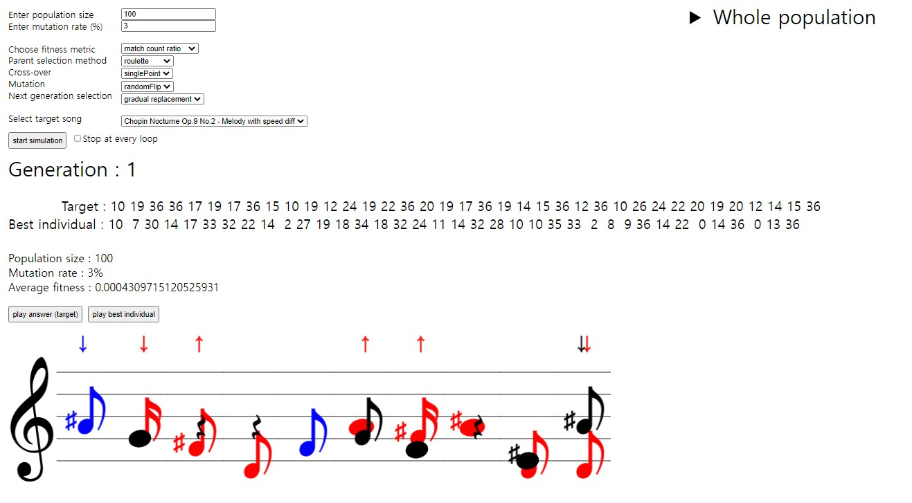
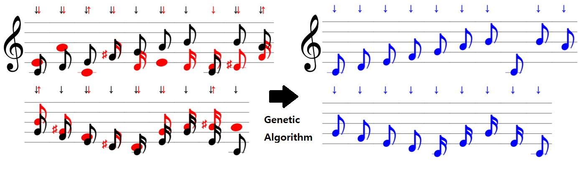
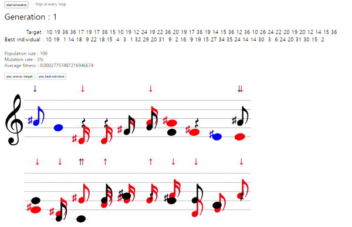
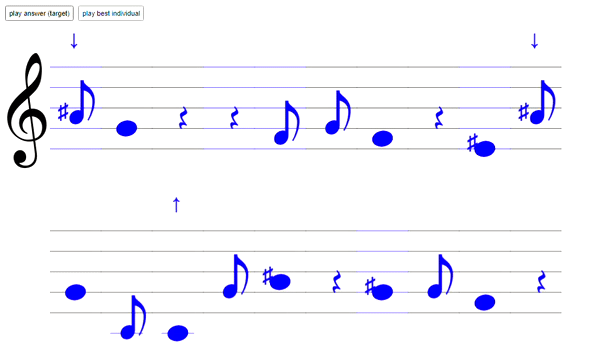
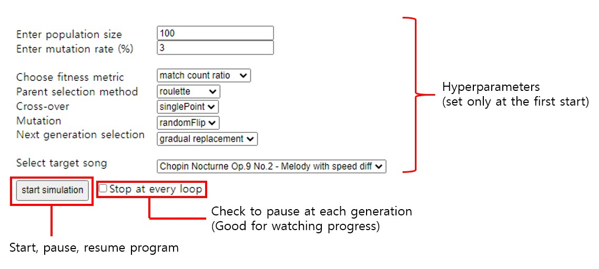
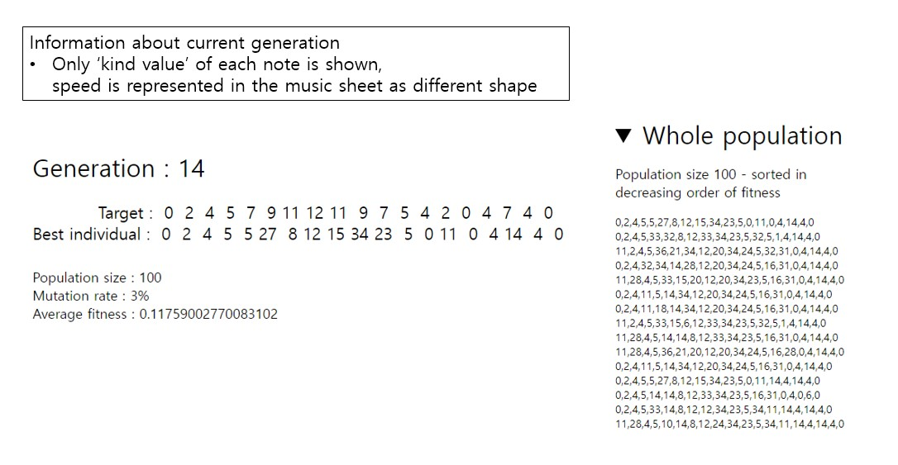

# Song GA

### Find target song with Genetic Algorithm

Genetic algorithm simulator made with p5.js and p5.sound.js




Starting from random notes (represented by numbers), find target song out of gazillion possible combinations of notes.


*Black note : target / red : initial random note / blue : match (after genetic algorithm runs)*




Play the notes whenever you want (play answer / play best individual button)




Test multiple options for genetic algorithm

* Fitness 

* Parent selection

* Cross-over

* Mutation

* Next generation selection

  

Including **Tournament selection (parent selection)**  and **Gradual replacement (next generation selection)** yields good result.

* Best combination so far : Count Fitness + Tournament selection (parent selection) + Total replacement (next generation selection)
  (Rest of the options are negligible)


### How to use it

Program settings (hyperparameters) – being set only at the first start (not between pause and resumes)



 <div style="page-break-after: always;"></div>

Info (current average fitness of the population, whole population) is easily visible.




Notes with different speed is shown on this music sheet.
Octave is represented with up(↑) and down(↓) arrows.
There are 12 kinds of notes in each octave (C, C#, D, D#, E, F, F#, G, G#, A, A#, B).
3 speed modes : 0 (𝅘𝅥𝅯), 1(𝅘𝅥𝅮), 2(𝅝).

Black note is the target, red note is the current best individual.
When two matches, the color turns blue.

 


### Program Structure
```markdown
src
└── lib 
│	├── p5.js
│	└── p5.sound.js
└── styles 
│	└── styles.css
└── img 
│	└── trebleClef.png
├── App.js
├── Population.js
├── Song.js
└── UI.js
```

* App.js
  : hyperparameter settings, runs evolutionary cycle using Population, tracks individual with best fitness  

* Population.js
  : Keeps population of Songs, evolutionary cycle methods implemented

* Song.js
  : genotype (array of notes), fitness metric, cross-over, mutation

* UI.js
  : visualization (p5.js) + audio play (p5.sound.js)

  <br>


- lib/p5.js and lib/p5.sound.js

  : Javascript visualization/audio library for UI creation


### Representation

Each **musical note** is represented with a pair of integers : [kind of note, speed].
There are 36 kinds of notes (12 notes in each octave, 3 octaves available) and 3 speed mode.

 ```js
// Song.js
// Create a new note - pair of two integers (kind and speed of the note)
// Kind - 0~35 : notes (C, C#, D, D#, E, F, F#, G, G#, A, A#, B) for 3 octaves, 36 : rest
// Speed - 0 (fast), 1, 2 (slow)
function newNote() {
  return [floor(random(0,37)), floor(random(0,3))]; // [kind, speed]
}
 ```


### To-do?

* Add UI/UX to create one's own song

  → Probably too messy, 36 kinds of notes with 3 speed modes each